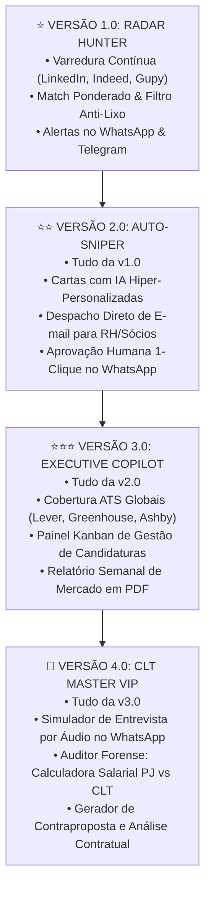

# 🚀 AUTONOMIA EMPREGOS — Career Copilot OS (SaaS 24/7)
## Plataforma Autônoma de Caça de Vagas, Cartas com IA e Assessoria Executiva de Carreira

> **Domínio Comercial:** [`empregos.autonomia.app.br`](https://empregos.autonomia.app.br)  
> **Repositório Oficial:** [`funil66/AUTONOMIA-EMPREGOS`](https://github.com/funil66/AUTONOMIA-EMPREGOS)  
> **Classificação Canônica:** Nó L3 — Produto Micro-SaaS B2C/B2B  
> **Arquitetura de Entrega:** Multicanal Humanizado (WhatsApp Evolution + Telegram Bot + E-mail Executivo)

---

## 🧭 1. Resumo Executivo & Missão
O **AUTONOMIA EMPREGOS** é uma solução SaaS criada para resolver a maior dor do profissional qualificado e do candidato moderno: **o cansaço mental, a sobrecarga de tempo e a humilhação algorítmica dos sistemas de recrutamento (Gupy, Indeed, LinkedIn)**.

Em vez de forçar o usuário a acessar dezenas de sites todos os dias e preencher cadastros repetitivos, o AUTONOMIA EMPREGOS opera como uma **Secretária Executiva de Carreira Particular no WhatsApp e Telegram**:
1. Varre o mercado 24/7 atrás de vagas que realmente combinam com o perfil, pretensão e modalidade do candidato.
2. Filtra anúncios lixo, vagas falsas ou presencial indesejado.
3. Redige cartas de apresentação cirúrgicas com Inteligência Artificial, atacando as dores exatas de cada empresa.
4. Conduz simulações de entrevista assíncronas por áudio com feedback imediato.
5. Permite ao candidato aprovar envios e candidaturas em **1 toque no celular**.

---

## 🏛️ 2. Topologia de Versões & Escada de Valor

O produto foi desenhado para ser lançado em **4 versões evolutivas**, permitindo tração rápida de caixa desde a v1.0 até a sofisticação da v4.0:



---

## 📂 3. Estrutura Estrutural do Nó (Pilar F)

```
📁 05_Vagas_Career_SaaS/
├── 📄 _INDEX.md                   ← (Este arquivo) Capa dura, visão e status do produto
├── 📄 _GLOSSARY.md                ← Dicionário de termos técnicos, entidades e métricas
├── 📄 _LOG_ATOS.md                ← Trilho temporal cronológico de atos de governança
├── 📁 docs/                       ← Documentação exaustiva e canônica
│   ├── 📄 01_CONCEITO_E_VISAO_DE_PRODUTO.md
│   ├── 📄 02_ESCADINHA_DE_VERSOES_E_ROADMAP.md
│   ├── 📄 03_ARQUITETURA_DE_SISTEMA_E_ESCALABILIDADE.md
│   ├── 📄 04_SCHEMA_DE_DADOS_E_SUPABASE.md
│   ├── 📄 05_ESTEIRA_DE_VENDAS_E_ONBOARDING.md
│   └── 📄 06_POLITICA_ANTI_PIRATARIA_E_BLINDAGEM.md
├── 📁 database/
│   └── 📁 migrations/             ← DDL SQL formal para Supabase / PostgreSQL
│       └── 📄 001_initial_schema_autonomia_empregos.sql
├── 📁 web/
│   └── 📁 landing_page/          ← Site oficial comercial (empregos.autonomia.app.br)
└── 📁 config/                     ← Configurações de ambiente, limites e prompts
```

---

## 🔗 4. Links de Navegação Canônica
- **Subir um nível (Zoom Out):** [[../_INDEX|03_MICRO_SAAS Master Hub]]
- **Glossário do Produto:** [[_GLOSSARY|Dicionário & Termos Técnicos]]
- **Trilho Temporal:** [[_LOG_ATOS|Histórico de Execuções e Checkpoints]]
