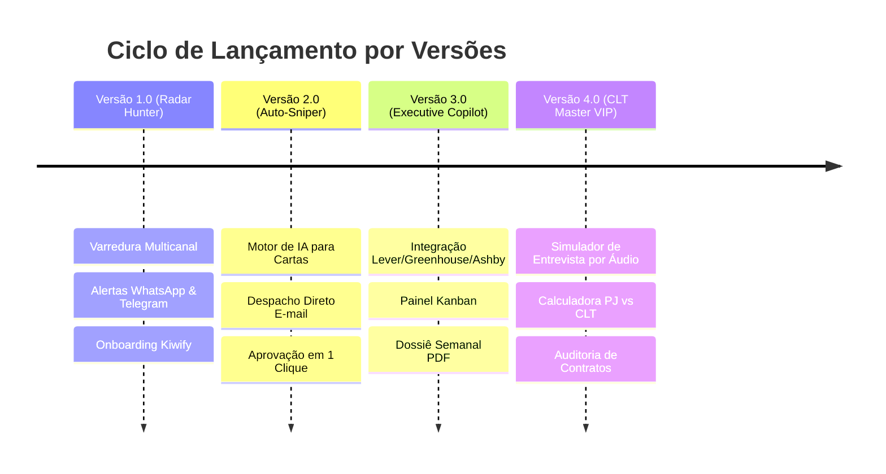

# 🗺️ Documento 02 — Escadinha de Versões & Roadmap Evolutivo

O ciclo de desenvolvimento do **AUTONOMIA EMPREGOS** adota a metodologia de entregas incrementais com monetização em cada marco:

---

## 1. Versão 1.0: "Radar Hunter" (MVP de Validação e Caixa Imediato)
- **Objetivo:** Lançar rápido, validar a esteira de pagamentos da Kiwify e entregar valor imediato de economia de tempo.
- **Funcionalidades:**
  1. Varredura agendada (4 vezes ao dia) nos portais LinkedIn Jobs, Indeed Brasil e Glassdoor via adaptadores assíncronos.
  2. Motor de filtragem determinística por:
     - Modalidade: Remoto (peso máximo), Híbrido ou Presencial na cidade do usuário.
     - Faixa salarial informada ou estimada.
     - Exclusão estrita de palavras-chave negativas ("estágio", "júnior", "banco de talentos").
  3. Notificação formatada via **Telegram Bot Oficial** e **WhatsApp Evolution API** com link direto da vaga.
  4. Comando `/config` no chat para o usuário alterar cargo e termos-chave a qualquer momento.

---

## 2. Versão 2.0: "Auto-Sniper" (Acelerador de Candidaturas com IA)
- **Objetivo:** Aumentar o ticket médio e resolver a etapa mais dolorosa: escrever uma carta atraente e achar o contato de RH.
- **Funcionalidades:**
  1. Tudo contido na Versão 1.0.
  2. **Gerador de Cartas Canônicas com IA:**
     - Analisa os requisitos da vaga e cruza com as experiências do candidato.
     - Gera uma carta formal de 4 parágrafos executivos pronta para envio.
  3. **Despacho Direto por E-mail (Sniper):**
     - O bot descobre o e-mail de contato do anunciante ou sócio responsável.
     - Envia no WhatsApp do candidato:
       > *"Encontrei uma vaga de Gerente Jurídico na Empresa X. Preparei esta carta de apresentação. Deseja que eu envie agora com seu currículo em PDF anexo?"*  
       > `[✅ Aprovar e Enviar]` `[✏️ Ajustar Texto]` `[❌ Ignorar]`
  4. Disparo seguro via servidor SMTP autenticado (Gmail ou Amazon SES) após aprovação humana explícita.

---

## 3. Versão 3.0: "Executive Copilot" (Bypass dos Portais e Gestão Kanban)
- **Objetivo:** Atender profissionais de alto escalão e expandir a busca para startups e multinacionais.
- **Funcionalidades:**
  1. Tudo contido na Versão 2.0.
  2. **Scrapers Específicos para Boards Globais:**
     - Monitoramento de feeds JSON públicos do **Lever**, **Greenhouse**, **Ashby** e **Workable**.
  3. **Painel Web Kanban (Área de Membros):**
     - Uma interface visual onde o candidato vê suas colunas:
       `[Identificadas]` ➔ `[Candidaturas Enviadas]` ➔ `[Em Análise]` ➔ `[Entrevistas]` ➔ `[Propostas]`.
  4. **Dossiê Semanal Executivo em PDF:**
     - Relatório enviado todo domingo por e-mail com as tendências de contratação da área do candidato.

---

## 4. Versão 4.0: "CLT Master VIP" (A Experiência Completa de Assessoria)
- **Objetivo:** O produto de ticket máximo, gerando autoridade pericial e fidelização anual.
- **Funcionalidades:**
  1. Tudo contido na Versão 3.0.
  2. **Simulador de Entrevista Assíncrono por Áudio (WhatsApp):**
     - A IA assume a persona de um recrutador exigente do setor da vaga.
     - Envia perguntas em áudio realístico no WhatsApp.
     - O candidato responde por áudio. O sistema transcreve via `faster-whisper` e devolve nota de 0 a 10 com diagnóstico de linguagem, vícios de fala e poder de convencimento.
  3. **Auditoria Forense de Proposta de Trabalho (PJ vs CLT):**
     - Calculadora de tributação e benefícios reais para orientar decisões de carreira.
     - Emissão de parecer com valor líquido anual comparado (incluindo FGTS, férias, 13º e PLR).
  4. **Gerador de Minuta de Contraproposta:**
     - Estruturação de e-mail formal para negociar bônus, modelo híbrido ou aumento salarial antes da assinatura.
