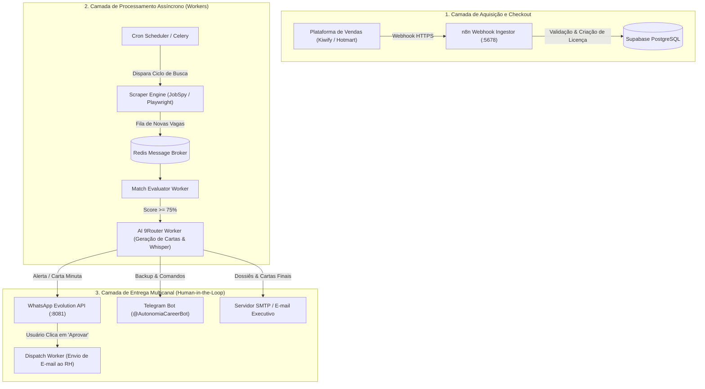

# 🏗️ Documento 03 — Arquitetura de Sistema & Escalabilidade

## 1. Visão Arquitetural Macro

O sistema adota uma arquitetura orientada a microsserviços e filas assíncronas para garantir que centenas de candidatos possam receber alertas e simulações simultaneamente sem sobrecarregar a máquina:

---

## 2. Princípios de Escalabilidade

1. **Desacoplamento de Scrapers:**  
   Scrapers nunca rodam dentro da requisição HTTP do usuário. Eles operam em segundo plano via workers com rotação de User-Agent e delays randômicos para evitar bloqueios de IP nos portais.
2. **Cache Centralizado de Vagas:**  
   Se 50 assinantes buscam o cargo de "Advogado Bancário Remoto", a varredura é realizada **uma única vez** no ciclo. Os resultados são cacheados e distribuídos para os perfis compatíveis, economizando 98% de requisições de rede.
3. **Resiliência a Quedas do WhatsApp:**  
   Se a instância do WhatsApp do produto passar por desconexão temporária de QR Code, todas as mensagens pendentes são enfileiradas no Redis e o assinante continua recebendo seus alertas normalmente via Telegram e E-mail.
4. **Isolamento Multitenant no Banco:**  
   Cada assinante possui seus próprios filtros, histórico de cartas e preferências protegidos por Row Level Security (RLS) no Supabase. Um usuário jamais tem acesso às candidaturas de outro.
