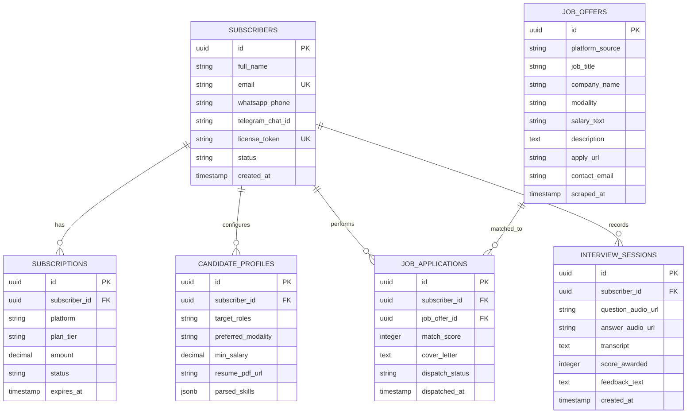

# 🗄️ Documento 04 — Schema de Dados & Estrutura Relacional no Supabase

## 1. Mapeamento das Tabelas no Supabase / PostgreSQL

O banco de dados relacional foi projetado para alta integridade referencial, auditoria completa e conformidade com a LGPD:

---

## 2. Índices e Performance
- `idx_subscribers_token`: Busca ultrarrápida por hash de licença na autenticação de webhooks e APIs.
- `idx_job_offers_url_hash`: Evita duplicação de vagas raspadas mais de uma vez.
- `idx_job_applications_composite`: Acelera a consulta do painel Kanban do usuário (`subscriber_id`, `dispatch_status`).
