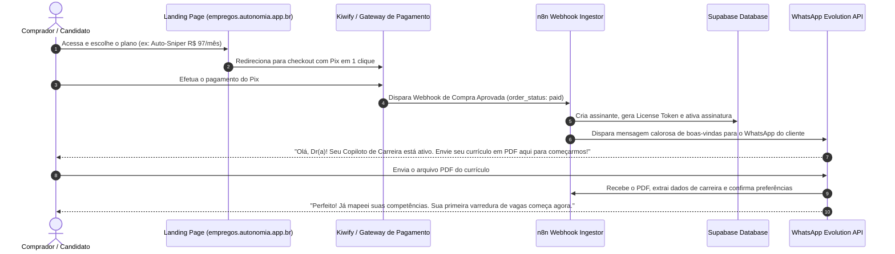

# 🛒 Documento 05 — Esteira de Vendas, Checkout & Onboarding Automático

## 1. O Funil de Conversão & Onboarding em Menos de 60 Segundos

A jornada do cliente foi desenhada para ter zero atrito técnico e entrega instantânea de valor:



---

## 2. Script de Boas-Vindas Humanizado no WhatsApp

Assim que a compra é aprovada, o assinante recebe a seguinte mensagem (com status de "digitando..."):

```text
Olá, {{nome}}! Tudo bem? 🎯

Sou a Clara, sua Assistente Executiva de Carreira da Autonomia Empregos.

Seu acesso ao plano {{plano}} foi confirmado com sucesso! 🚀

A partir de agora, você não precisa mais perder horas navegando em sites de vagas. Eu vou caçar as melhores oportunidades para você 24 horas por dia.

Para configurarmos seu perfil em 1 minuto, por favor:
1️⃣ Me envie aqui o arquivo PDF do seu currículo mais atualizado.
2️⃣ Me diga: qual o cargo que você busca e sua pretensão salarial mínima?

Estou pronta! Pode me mandar o PDF por aqui mesmo. 👇
```
